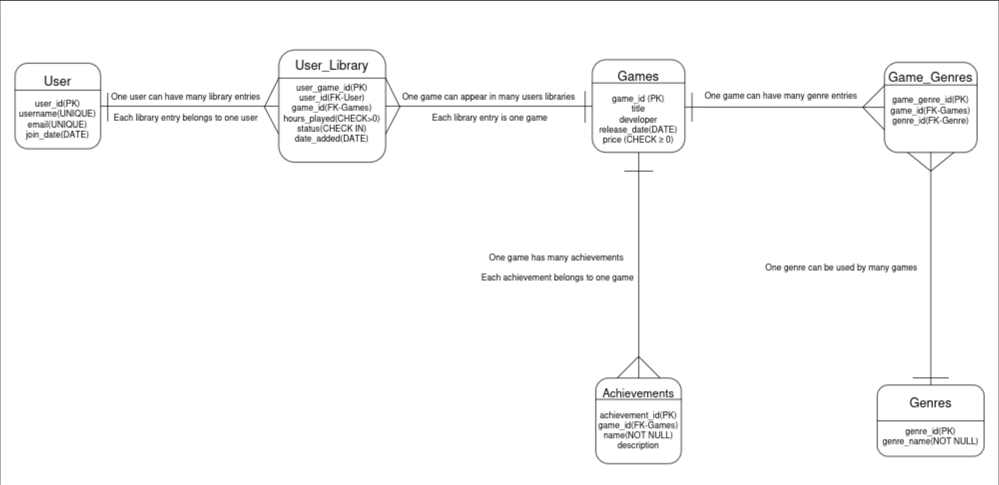

<!DOCTYPE html>
<html lang="en">
<head>
<meta charset="UTF-8">
</head>
<body>

<h1>🎮 Steam Tracker</h1>

Steam Tracker is a Python + MySQL application for tracking users, games, and game libraries.
It uses a menu-driven CLI and a relational database to manage users, games, playtime, and game status.

<h2>Features</h2>
<ul>
  <li><strong>User Management:</strong> Add and delete users (with automatic library cleanup).</li>
  <li><strong>Game Management:</strong> Add games with title, developer, release year, and price.</li>
  <li><strong>User Library:</strong> Track each user's games, status, and playtime.</li>
  <li><strong>Safe SQL Transactions:</strong> Used for user deletion and library updates.</li>
  <li><strong>View Full User Libraries:</strong> Joined data of all games owned by all users.</li>
</ul>

<h2>Project Structure</h2>
<pre>
/steam-tracker
│
├── main.py              # CLI logic
├── database.py          # Database operations
├── README.md            # Documentation
├── requirements.txt     # Python dependencies
│
├── schema.sql           # Database schema (tables + constraints)
├── data.sql             # Sample data
├── queries.sql          # Example queries for testing/demo
│
└── ERD.png              # Entity Relationship Diagram
</pre>

<h2>Entity Relationship Diagram (ERD)</h2>

This diagram visualizes how users, games, libraries, genres, and achievements relate to each other.

<h2>SQL Files</h2>

<h3><code>schema.sql</code></h3>

Contains all <strong>CREATE TABLE</strong> statements including:
<ul>
  <li>Primary keys</li>
  <li>Foreign keys</li>
  <li>Constraints</li>
  <li>Cascade delete behavior</li>
</ul>

<h3><code>data.sql</code></h3>

Provides sample data for testing:
<ul>
  <li>Users</li>
  <li>Games</li>
  <li>User libraries</li>
  <li>Genres</li>
  <li>Achievements</li>
</ul>

<h3><code>queries.sql</code></h3>

Includes useful queries such as:
<ul>
  <li>Viewing all user libraries (JOINs)</li>
  <li>Filtering by status (wishlist, owned, etc.)</li>
  <li>Playtime reports</li>
  <li>Update examples</li>
</ul>

<h2>Database Schema Overview</h2>

<h3>1. <code>users</code></h3>
<table border="1" cellpadding="5">
<tr><th>Column</th><th>Type</th><th>Description</th></tr>
<tr><td>user_id</td><td>INT AUTO_INCREMENT</td><td>Primary Key</td></tr>
<tr><td>username</td><td>VARCHAR(255)</td><td>User name</td></tr>
<tr><td>email</td><td>VARCHAR(255)</td><td>User email</td></tr>
</table>

<h3>2. <code>games</code></h3>
<table border="1" cellpadding="5">
<tr><th>Column</th><th>Type</th><th>Description</th></tr>
<tr><td>game_id</td><td>INT AUTO_INCREMENT</td><td>Primary Key</td></tr>
<tr><td>title</td><td>VARCHAR(255)</td><td>Game title</td></tr>
<tr><td>developer</td><td>VARCHAR(255)</td><td>Developer</td></tr>
<tr><td>release_year</td><td>INT</td><td>Release year</td></tr>
<tr><td>price</td><td>DECIMAL(6,2)</td><td>Price</td></tr>
</table>

<h3>3. <code>user_library</code></h3>
<table border="1" cellpadding="5">
<tr><th>Column</th><th>Type</th><th>Description</th></tr>
<tr><td>user_id</td><td>INT</td><td>FK → users</td></tr>
<tr><td>game_id</td><td>INT</td><td>FK → games</td></tr>
<tr><td>status</td><td>VARCHAR(50)</td><td>wishlist, owned, playing, completed</td></tr>
<tr><td>hours_played</td><td>INT</td><td>Playtime</td></tr>
</table>

<h3>4. <code>genres</code></h3>
<table border="1" cellpadding="5">
<tr><th>Column</th><th>Type</th><th>Description</th></tr>
<tr><td>genre_id</td><td>INT AUTO_INCREMENT</td><td>Primary Key</td></tr>
<tr><td>genre_name</td><td>VARCHAR(255)</td><td>Genre name</td></tr>
</table>

<h3>5. <code>game_genres</code></h3>
<table border="1" cellpadding="5">
<tr><th>Column</th><th>Type</th><th>Description</th></tr>
<tr><td>game_id</td><td>INT</td><td>FK → games</td></tr>
<tr><td>genre_id</td><td>INT</td><td>FK → genres</td></tr>
<tr><td>PRIMARY KEY</td><td>(game_id, genre_id)</td><td>Composite key</td></tr>
</table>

<h3>6. <code>achievements</code></h3>
<table border="1" cellpadding="5">
<tr><th>Column</th><th>Type</th><th>Description</th></tr>
<tr><td>achievement_id</td><td>INT AUTO_INCREMENT</td><td>Primary Key</td></tr>
<tr><td>game_id</td><td>INT</td><td>FK → games</td></tr>
<tr><td>title</td><td>VARCHAR(255)</td><td>Achievement name</td></tr>
<tr><td>description</td><td>TEXT</td><td>Description</td></tr>
<tr><td>points</td><td>INT</td><td>Score value</td></tr>
</table>

<h2>Installation & Setup</h2>

<h3>1. Install Dependencies</h3>
<pre>
pip install -r requirements.txt
</pre>

<h3>2. MySQL Setup</h3>

<pre>
CREATE DATABASE steam_tracker;
USE steam_tracker;
</pre>

Run schema:

<pre>
SOURCE schema.sql;
</pre>

Optional sample data:

<pre>
SOURCE data.sql;
</pre>

<h2>Running the Program</h2>

<pre>
python main.py
</pre>

<pre>
🎮 Steam Tracker
1. Add User
2. Add Game
3. Delete User + Library
4. Add Game to Library + Set Status
5. View All User Libraries
6. Update Playtime
7. Exit
</pre>

<h2>Feature Breakdown</h2>

<h3>Add User</h3>

Creates a new user.

<h3>Add Game</h3>

Adds a new game.

<h3>Delete User + Library</h3>

Uses transactions to safely remove user and related data.

<h3>Add Game to Library</h3>

Adds a game and updates status (wishlist → owned supported).

<h3>View Libraries</h3>

Displays all users and their games using JOIN queries.

<h3>Update Playtime</h3>

Updates hours played.

<h2>Error Handling</h2>
<ul>
  <li>Input validation (ValueError)</li>
  <li>MySQL connection errors</li>
  <li>Transaction rollback</li>
  <li>Clear debug messages</li>
</ul>

<h2>Future Improvements</h2>
<ul>
  <li>CSV export</li>
  <li>GUI (Tkinter / PyQt)</li>
  <li>Steam API integration</li>
  <li>Filtering & sorting</li>
</ul>

</body>
</html>
